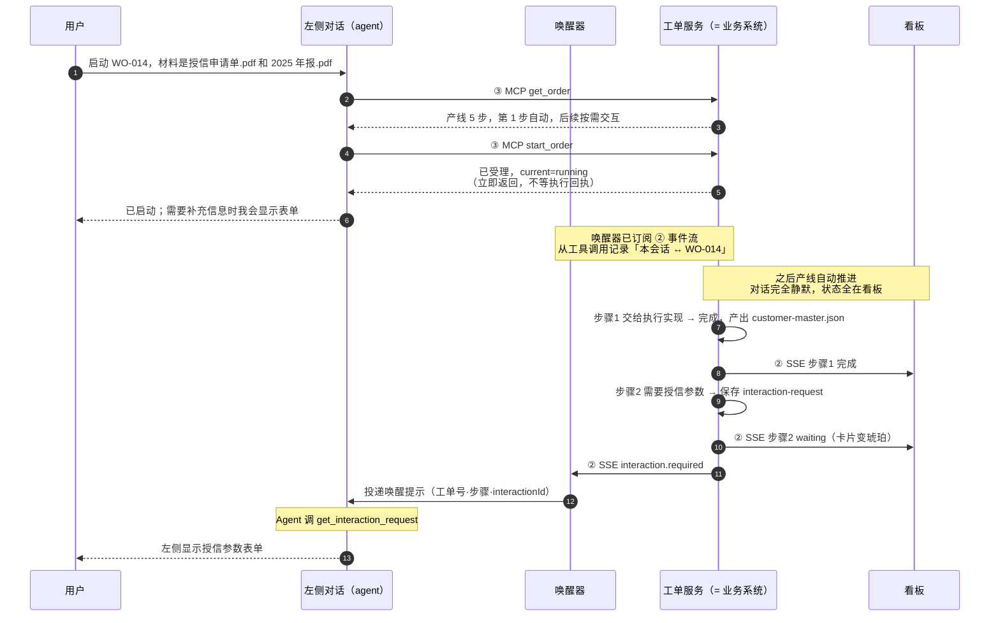
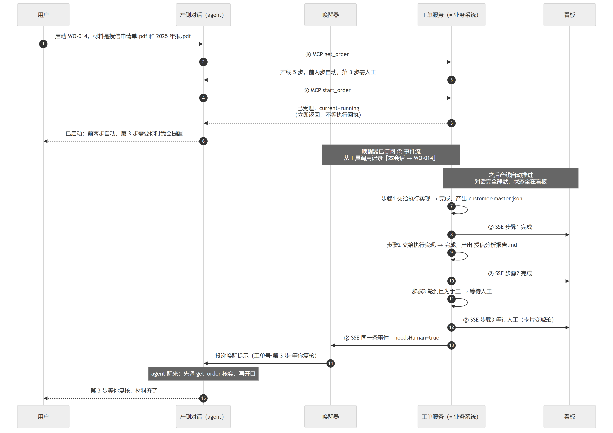
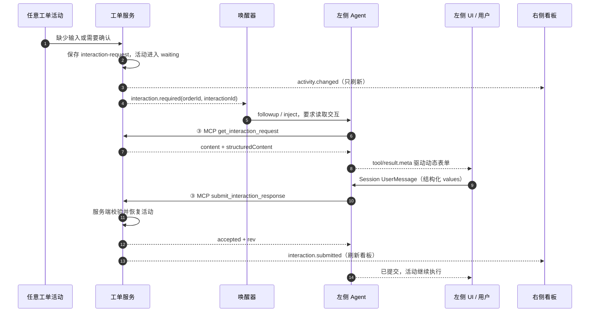
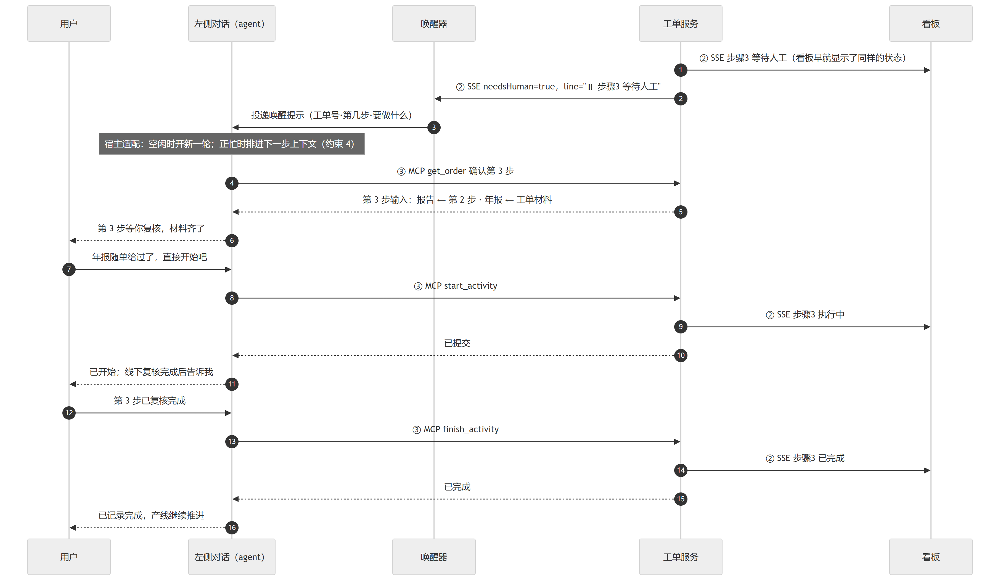
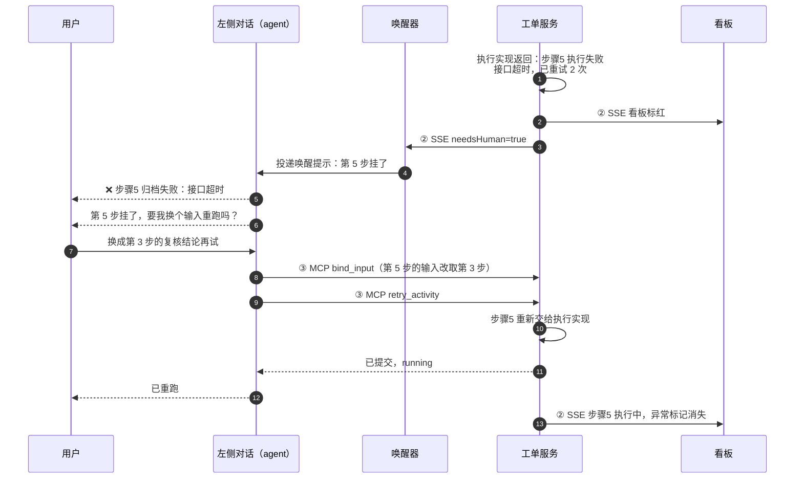
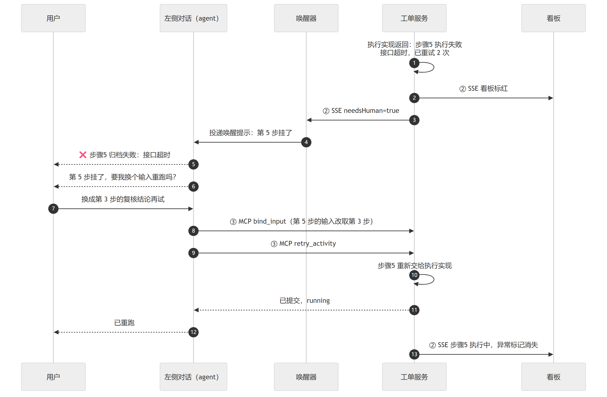

# 工单作业设计

## 摘要

本设计把 DSH Web 右侧的通用浏览页替换为业务用的工单产线看板，并在左侧对话中增加由工单消息驱动的结构化表单。工单状态与交互定义独立于 DSH，由业务系统负责产线推进、`interaction-request` 和事件发布，由右侧看板负责只读展示，由左侧 Agent 通过 MCP 查询和写入。唤醒器只把 `interaction.required` 或其他服务判定的阻塞事件投递到对应会话，不把普通进度写入 Agent 上下文。交互原则是“右边看，左边处理”：需要人时，Agent 读取权威交互并显示表单，用户提交后由 Agent 调用 MCP 恢复活动。

## 目录

- [几个词](#几个词)
- [一、整体架构](#一整体架构)
- [二、各模块责任边界](#二各模块责任边界)
- [三、页面原型](#三页面原型)
- [四、三个关键过程](#四三个关键过程)
- [开发顺序与验收](#开发顺序与验收)
- [已确认的产品约束](#已确认的产品约束)
- [Dev Note](#dev-note)

> **这一份是唯一的业务设计文档。** 只讲四件事：整体架构、各模块的责任边界、页面原型、三个关键过程。实现细节不在这一份里——先把架构对齐，末端细节后补。接口路径、载荷和 mock 的当前限制由 [`workorder-service/README.md`](workorder-service/README.md) 维护；两份文档不要重复抄接口清单。讨论过程存档在 [`_archive/`](_archive/README.md)，**设计时不要读**。

## 几个词

| 词 | 意思 |
|---|---|
| 工单 / 产线 | 一个工单对应一条产线 |
| 活动 | 产线上按顺序排列的一步，界面上按顺序显示为「第 N 步」。四种类型：工具 / agent / 手工 / 质检。**这里的 `agent` 指「这一步由 AI 来跑」**，与左侧「对话里的 agent」不是同一个东西 |
| 自动化标记 | 这一步由产线自己跑（`auto`），还是等人通过对话下达（`manual`）。**与类型正交**：「工具 + 需人工」是成立的 |
| 输入绑定 | 这一步的输入件取自哪一个具体资源：前面某一步的某个输出件，或某份工单材料。**可以改**——异常处置就落在这里。生产数据必须用稳定资源标识，只有步骤号不足以证明该输出存在 |
| 工单材料 | 用户随工单提供的输入文件（示例工单里是授信申请单.pdf、2025 年报.pdf），不是任何活动的产出 |
| 输出件 / 交付件 | 每个活动产出的文件、文本或记录叫**输出件**；看板把它们汇总在右下角，那一区叫**交付件区** |
| `waiting` | 一个**活动状态**：轮到它了，但它是人工活动，产线推不动。与 `pending`（还没轮到）必须分开 |
| `needsHuman` | 事件里的一个**字段**，由服务判定并填好。唤醒器据此决定要不要叫醒 agent，不自己算 |
| `line` | 事件里一行**给人看的文案**（如「⏸ 步骤 3 等待人工」），由服务拼好。唤醒器拿去用在唤醒提示里，不自己编 |
| 唤醒器 | 运行在 Agent Host 内的常驻接线件：订产线事件流，把需要人的事件以用户消息的口吻投进对应会话（模拟人传话）。MVP 在内存中维护会话绑定、消费游标和唤醒预算；生产实现必须持久化这些数据。换 agent 宿主只改它的投递目标 |
| 决策记录 | 谁通过哪个会话或调用在什么时候改了哪一步、改前改后是什么、为什么。审计口径，只记真实成功提交的业务变化 |

## 一、整体架构

<!-- BEGIN architecture-ascii（由 tools/build-architecture-ascii.mjs 生成，不要手改） -->
```
  ┌─────────────────────────────────────────────────────────┐
  │ workorder 服务 workorder-service                        │
  │ = 业务系统；demo 里是 mock 实现，真实部署由业务方提供   │
  │ 独立包与端口 · 零 DSH 依赖                              │
  │                                                         │
  │ 执行引擎：认产线结构 · 推状态机 · 判该不该喊人          │
  │ 执行实现：活动怎么真跑；demo 里是模拟的                 │
  │                                                         │
  │ 产线状态 · 事件流                  MCP 工具面           │
  └──────────┬─────────────────────────────────────┬────────┘
             │                                     │
               ① HTTP 读接口                       │ ③ MCP 工具面
               ② SSE 事件流                        │
             │                                     │
     ┌───────┴───────────────┐                     │
     │                       │                     │
     ▼                       ▼                     │
  ┌────────────┐       ┌──────────────┐            │
  │ 工单看板   │       │ 唤醒器       │            │
  │ 直连·只读  │       │ 过滤·路由    │            │
  └────────────┘       └───────┬──────┘            │
                               │ 投递消息          │
                               ▼                   │
                       ┌─────────────────────────┐ │
                       │ Agent 宿主（今日 DSH）  │ │
                       │ 左侧对话：用户 ⇄ agent  │─┘
                       └─────────────────────────┘
```
<!-- END architecture-ascii -->

**三个主体，一个宿主适配器。** 图里的 **workorder 服务就是业务系统**——今天这份是 mock 实现，真实部署时由业务方提供同一组外部能力；三组接口是双方需要共同维护的兼容约定。三个主体是 **Agent 宿主**（左侧对话，今日 DSH）、**工单看板**和 **workorder 服务**。唤醒器是运行在 Agent 宿主内的适配器模块，不是独立业务系统；它负责事件消费、路由、去重、预算和消息投递，因此需要独立配置、状态与测试。换 Agent 宿主时替换唤醒器的宿主适配层，业务服务和看板不随之改动。

当前 mock 服务内部有三项职责：

- **执行引擎**：认产线结构、判输入是否就绪、推状态机、决定什么时候该喊人。在保留本服务骨架、只替换执行方式时不变。
- **执行实现**：活动真的怎么跑。今天用模拟的（等几秒算完成，可注入一次失败）；沿用本服务骨架时把它换成真实调用。
- **状态与三组对外接口**：产线状态、事件流 + 读接口 / 事件流 / 工具面。服务不保存 Agent Host 的会话绑定。

真实业务系统可以整体替换这份 mock，也可以沿用骨架只替换执行实现。无论采用哪种方式，对消费者稳定的是外部行为、字段语义和失败方式，不是 mock 的内部文件或类划分。

**服务零 DSH 依赖**：当前 mock 可以单独启动、单独 `curl`，将来整个搬走；看板与它直连，同样不经过 DSH。检验两个系统是不是真的分开：**把 DSH 拿掉，服务照跑、看板照用**——缺的只有「没人在对话里替产线喊人」，这正是唤醒器补上的那一块。

**持久化是生产必需，不是当前 mock 能力。** 产线状态与决策记录由生产业务服务持久化；会话绑定、消费游标和唤醒预算由唤醒器的存储持久化。服务或唤醒器重启后必须恢复各自拥有的数据。当前 mock 的状态和绑定均为进程内内存数据，重启会丢失。生产接口还必须提供事件断线后的重放或重同步办法，否则唤醒器可能错过一次 `needsHuman` 事件。

**状态提交与事件发布必须保持同一顺序。** 生产服务先持久化状态、决策记录和事件游标，再发布事件；同一工单的写操作按顺序串行化，重复请求不能重复推进。消费者按集成接口冻结的事件游标检测缺口并重新读取权威快照，不能把 SSE 当成可独立重放的完整状态。

## 二、各模块责任边界

| 模块 | 做什么 | 产出给谁 | 不做什么 |
|---|---|---|---|
| **workorder 服务**（= 业务系统，今日 mock） | 跑产线：执行引擎推状态机、执行实现真跑活动；记状态、发事件 | **给看板的**：① 全量 + ② 增量<br>**给唤醒器的**：② 事件流<br>**给 agent 的**：③ 工具面 | 不认识 Agent 宿主的内部结构、不依赖 DSH；不保存会话绑定；不提供工单编排界面；第一版不做工单增删。当前 mock 状态只在内存中，生产状态必须持久化 |
| **工单看板**（右栏页面，直连服务） | 从 Host 页面注入取得服务地址和 MVP `orderId`，拉 ① 全量、订 ② 增量，把工单画成产线看板 | **给人的**：只读的产线全貌（没有操作按钮） | 不做第二个写入口、不复制 agent 会话状态；直连不等于可写——服务对它只开读与事件流。按会话选工单属于 Task 11 |
| **Agent 宿主**（左侧对话，今日 DSH） | 人看进度、下指令；agent 调 ③ 查工单、推进、改绑定、重跑 | **给服务的**：工具调用<br>**给唤醒器的**：消息投递接口（inject / followup） | 对话结构、消息流、输入框照旧；换宿主 = 重挂 MCP 配置、唤醒器换投递目标 |
| **唤醒器**（接线件，宿主无关） | 订 ② 事件流；从工具调用记「会话 ↔ 工单」绑定；`needsHuman` 时按预算把提示投进对应会话。MVP 使用内存状态，Task 7 增加持久化 | **给 agent 的**：唤醒提示 | 不自己判 `needsHuman`、不渲染看板、不碰工单数据、不让业务服务保存第二张绑定表 |

**工单服务和唤醒器的职责，以及核心约束 1 至 3，会牵动多个组件**：接口或唤醒口径一变，看板、唤醒器、agent 至少其一要跟着改。页面布局与配色可以独立演进，但字段含义、状态文案和可操作提示仍须与服务状态保持一致。

### 三组接口：谁调哪一组

服务在一个端口上开三组入口：**① 读接口给看板**（拉工单全量与决策记录）、**② 事件流给看板与唤醒器**（产线一变就推一条，谁都不用轮询）、**③ 工具面给 agent**（查工单、推进、改绑定、重跑）。跨模块调用关系、当前字段、失败与恢复语义以及替换要求由 [`INTEGRATION_CONTRACTS.md`](INTEGRATION_CONTRACTS.md) 维护；服务自身的运行方式与公开入口由 [`workorder-service/README.md`](workorder-service/README.md) 维护。

两件容易读拧的事：

- **看板调的真实路径不带 `/api`**：直连需要服务放行看板来源的跨域。当前 mock 默认只允许本地 `127.0.0.1:3081` 与 `localhost:3081`；真实部署的允许来源与认证归业务方标准。
- **服务不提供 `/bindings`**：会话与工单的绑定属于唤醒器，因为业务服务不认识 Agent Host。不能在服务中保留第二份权威记录。

### 核心约束

1. **右侧只读**——不做第二个写入口。看板直连服务也不破这条：服务对看板只开读接口与事件流，工单数据唯一的写路径是 agent 的 ③ MCP。两套写入口会让权限、审计、谁改的状态都说不清。
2. **步骤执行信息不进 agent 上下文**——每步的开始、完成、异常只推给看板展示；agent 不读历史进度：醒来靠唤醒提示定位，决策靠现查 `get_order` 拿权威状态。历史进度行对判断零增量，反有过期状态冒充当前的风险。（「展示与唤醒分离」就落在「进不进上下文」上；若将来想让对话里也能看到流水，通道另选，原则不变：只展示、不进上下文。）
3. **只有 `needsHuman` 才有资格唤醒 AI**——每一步都会发事件（看板与唤醒器都收得到），但只有新进入 `waiting`（等人工）或 `failed`（挂了）的阻塞轮次才叫醒 agent。失败状态内的输入绑定变化、重复事件和断线重放不再次唤醒；唤醒器使用服务给出的 `needsHuman`，并按持久化的事件游标去重，不重新推导业务状态。
4. **唤醒次数要有上限，投递 ≠ 处理**——预算由唤醒器按“会话 + 工单”执行，默认连续 3 次：空闲才开新一轮，正忙时只把通知排进下一步上下文、不另开一轮；只有真人输入重置预算。耗尽后看板保留告警，但唤醒器不再主动开轮。投递成功只表示宿主接收了消息，不承诺模型会处理、更不承诺工单被推进。
5. **工具一律立即返回**——「启动工单」返回「已提交」，不等到跑完。跑两小时的活动不能占住 agent 的一轮对话。
6. **外部文本一律不可信**——活动标题、失败原因来自业务数据，可能来自另一个模型。进对话时标注为不可信内容，不拼成指令；唤醒器拼提示时同样标注。
7. **写操作必须校验状态并支持幂等重试**——推进工具只允许操作当前活动，并检查允许的来源状态；请求携带幂等键和可选的期望工单版本，重复提交返回原结果，过期状态明确返回冲突。工具的“已受理”结果带操作标识，供事件与审计记录关联。
8. **输入绑定必须指向真实资源**——目标只能是当前阻塞活动或尚未开始的后续活动，来源只能是工单材料或已完成前序活动的具体输出件。服务校验资源标识、来源顺序和可用性，拒绝不存在的输出、后向依赖和循环依赖。当前 mock 的 `fromSeq` 只能表示步骤，不能满足生产校验。
9. **决策记录必须可审计且不可改写**——生产记录至少包含实际操作者或系统身份、会话或调用来源、操作标识、活动、动作、原因、发生时间以及关键字段的前后值。消息投递不算业务决策，失败的写操作也不能伪造为已发生的决策。

“立即返回”是生产接口契约：工具只负责校验、登记和提交，不同步等待执行回执。当前 mock 的 `start_order` 为了演示会快进到下一个阻塞点；这不是生产时序，不能作为长活动实现的依据。真实执行应由引擎异步推进，并通过 ② 发布状态变化。

### 唤醒器的契约（宿主无关，换 agent 照此重接）

| 项 | 内容 |
|---|---|
| 输入 | 订 ② 事件流。服务不改、不认识任何宿主 |
| 判断 | 只认服务填好的 `needsHuman`，自己不判 |
| 输出 | 调一次**宿主的消息投递接口**，把提示投进绑定会话——模拟人来向 agent 发消息 |
| 必带 | 工单号、第几步、等待/失败原因，全部取自事件字段；业务文本按约束 6 标注不可信 |
| 禁止 | 不渲染看板、不修改工单业务数据；路由绑定只写入唤醒器自己的持久存储，不做双写 |

- **DSH 投递适配**：参考 `tool-jobs` 的现有做法，目标会话有 live Agent 且空闲时调用 `Agent.followup()` 排队并唤醒，正忙时调用 `Agent.inject()` 写入下一步上下文但不另开一轮。Agent 收件箱在配置 Session 持久化后可随会话恢复；唤醒器还必须处理目标会话尚未加载的情况，不能把 `ctx.agents.get(sessionId)` 返回空当作投递成功。换其他 agent 宿主时只替换这一层。
- **绑定来源**：唤醒器观察 DSH 已提交的顶层 `tool/call`，解析工单 MCP 工具参数里的 `orderId`，并在对应 `tool/result` 成功后更新自己的绑定存储。第一版必须把工单 MCP 暴露为原生工具；PTC-only 模式下顶层只记录 `run_code`，无法据此取得嵌套调用的 `orderId`，必须另加显式绑定工具或调用包装。一张工单只有一个主会话，一个会话可以处理多张工单。

### 集成接口参考

右栏与服务、服务与唤醒器、唤醒器与 Agent 以及 Agent 与 MCP 的字段和时序由 [`INTEGRATION_CONTRACTS.md`](INTEGRATION_CONTRACTS.md) 定义。该文档把当前 MVP 与生产目标分开，并列出替换业务系统或 Agent 宿主时必须保持的语义。任何跨模块字段、状态、版本、重放、绑定或投递规则变更必须先更新该文档及相关黑盒测试，再修改消费者。

任意活动需要用户填写或确认时，工单服务生成通用 `interaction-request`；字段白名单、DSH 左侧渲染、模型消息和提交后的恢复流程由 [`FORM_DESIGN.md`](FORM_DESIGN.md) 定义。该协议不依赖活动类型或 A2A；动态表单不是右栏写入口，浏览器提交先进入 DSH Session，再由 Agent 调用工单 MCP。

## 三、页面原型

产品页面由 [`workorder-ui`](plugins/workorder-ui/README.md) Client 插件注册到 DSH 右侧栏。MVP 页面直接展示一张种子工单的活动顺序、当前状态、人工阻塞标记和输入/输出元数据；下图保留完整产品布局的信息层级：

<!-- BEGIN pane-ascii（由 tools/build-architecture-ascii.mjs 生成，不要手改） -->
```
┌────────────────────────────────────────────────────────────┐
│ 作业区（约 3/4）                                           │
│  [ 作业记录 ]  [ 决策记录 ]        ← 两个 tab              │
│                                                            │
│  ①  [工具]   拉取客户主数据      自动      已完成          │
│   输入 工单基本信息 → 输出 customer-master.json            │
│  ②  [agent]  生成授信分析报告    自动      等待输入        │
│   输入 ←① customer-master.json                             │
│  ③  [手工]   复核财报口径        需人工    待开始          │
│   输入 ←② 授信分析报告.md                                  │
│                                                            │
│ 第 2 步需补充参数 · 请在左侧表单填写                        │
├────────────────────────────────────────────────────────────┤
│ 交付件区（约 1/4）  来自活动 ①②③ …                         │
└────────────────────────────────────────────────────────────┘
```
<!-- END pane-ascii -->

- **活动卡片**自上而下四段：类型徽章 + 标题 + 状态 / 自动化标记与执行者 / 输入件与输出件 / 异常原因。输入胶囊带 `←n` 标明取自哪一步的输出——绑定可改，所以来源必须看得见。
- **状态色**：`待开始` 灰、`等待人工` 琥珀、`执行中` 蓝、`已完成` 绿、`异常` 红；`已跳过` 使用中性的灰色，不与 `已完成` 混淆。
- **驱动提示条**常驻在作业区底部，随当前一步显示自动执行、等待表单、失败澄清或继续推进。需要结构化输入时，左侧工具卡提供字段和提交入口；提示条不要求用户记忆命令。
- **卡片上没有业务按钮**。页面可以切换只读视图、重试加载、选择工单和打开交付件，但所有工单写操作都从左侧对话进入。
- **MVP 显示 Host 配置的一张工单**：Host 把经过校验的 `serviceUrl` 与 `orderId` 注入 Web 页面。Task 11 再改为默认显示当前会话最近活动的工单，并提供只读选择器切换该会话已绑定的其他工单。
- **数据怎么来的**：MVP 页面从业务服务拉取 `GET /orders/:id`，再订阅 `GET /events?orderId=...`。当前 ② 事件是刷新信号，不是完整 patch；看板收到更新的 `rev` 后重拉完整快照，断线时保留最后一份快照并显示明确状态。页面从活动 `outputs` 展示交付件元数据；资源读取和决策记录不在 MVP 内。本地服务为 `127.0.0.1:3081` 开放开发 CORS，生产来源与认证由 Task 10 收紧。

## 四、三个关键过程

### 时序一：启动工单，自动推进到交互点



**最该记住的一点**：中间那一大段，**对话完全静默，AI 一次都没有被唤醒**——看板独自刷新。步骤执行信息不进 agent 上下文（约束 2），唯一能让 AI 开口的是唤醒器的投递。

**第二点**：那几步的推进**不是服务自己算出来的**——引擎把活动交给执行实现，等它返回结果，再把结果变成一条事件。图上的 `S->>S` 是服务内部两样东西在说话（引擎 ↔ 执行实现），不是自己跟自己确认了一遍。



### 时序二：某一步需要人 → 左侧渲染表单并继续



**要点**：工单服务拥有完整交互，SSE 只携带 `interactionId`；UI 不查询 MCP，也不从模型散文猜控件。表单提交先写入 Session，服务端校验成功后才恢复活动。投递仍不等于模型已处理。



### 时序三：自动活动跑挂了 → 人在对话里处置



**要点**：失败也走同一条通道——服务判 `needsHuman`，唤醒器叫醒 AI。处置动作是「改绑定 + 重跑」，两个工具都立即返回。



## 开发顺序与验收

实施顺序、每项范围、构建命令和完成标准由 [DEVELOPMENT_PLAN.md](DEVELOPMENT_PLAN.md) 维护。实现依次完成最小工单服务、业务 Profile、原生 MCP、唤醒器、只读右栏和端到端闭环；生产持久化、完整异常处置、交付件与安全配置只能在最小闭环通过后分别强化。上一任务未通过，不得开始下一任务。

## 已确认的产品约束

1. **绑定归 Host 唤醒器。** 唤醒器持久化绑定、消费游标和预算；一张工单只有一个主会话，一个会话可以处理多张工单。业务服务不保存宿主会话标识。
2. **右栏 MVP 显示一张配置工单。** Host 注入单个 `orderId`；Task 11 再让右栏默认跟随当前会话最近活动的工单，并提供只读选择器切换该会话已绑定的工单。
3. **工单从 `ready` 启动。** `start_order` 只允许 `ready → running`；相同幂等键返回原结果，其他非法状态返回明确冲突。
4. **交互与活动类型解耦。** 有交互模板的活动统一由 `submit_interaction_response` 从 `waiting` 恢复；没有模板的旧式人工活动仍通过 `start_activity` 和 `finish_activity` 显式处理。
5. **交付件使用不透明资源标识。** 输出件返回 `resourceId`；看板通过受认证的读取接口预览或下载，不暴露宿主文件路径。
6. **唤醒预算按会话和工单计算。** 默认最多连续主动唤醒 3 次，只有真人输入重置；预算耗尽后看板显示告警，唤醒器不再主动开轮。

文中的 ASCII 图和时序图 PNG 都由脚本生成，不要手改生成区或图片：

```sh
node business-agent/tools/build-architecture-ascii.mjs   # 两处 ASCII 图（按显示宽度对齐，自带校验）
node business-agent/tools/render-diagrams.mjs            # mermaid → diagrams/*.png
```

DSH 的聊天区与文件预览都不渲染 mermaid，所以要存 PNG 才能在任何地方看。

## Dev Note

None.
