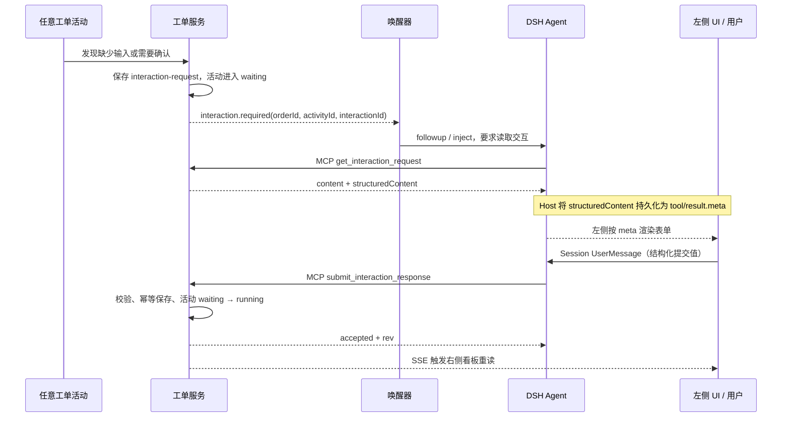

# 工单动态交互表单设计

## 摘要

动态表单属于工单交互协议，不属于 A2A 或某一种活动。Agent、手工、质检和工具活动都可以阻塞并请求人补充信息。工单服务是 `interaction-request` 的唯一权威来源；DSH Agent 通过 MCP 读取和提交交互；左侧 Client 只渲染持久化在工具结果中的结构化元数据，不解析模型散文，也不直接写工单。

## 责任与闭环

| 组件 | 责任 | 禁止 |
|---|---|---|
| 工单服务 | 生成、保存、校验交互；推进活动；发布事件 | 保存 DSH Session 标识 |
| 唤醒器 | 把 `interaction.required` 路由到已绑定 Session | 推导字段或修改工单 |
| DSH Agent | 调用读取和提交 MCP；向用户解释结果 | 自行发明表单字段 |
| 左侧 Client | 从 `tool/result.meta` 渲染白名单控件；把提交写入 Session | 解析模型文本；直连写接口 |
| 右侧看板 | 用 HTTP 快照和 SSE 刷新展示工单 | 提交业务状态 |



这条链路闭合了四个事实：表单定义可按 `interactionId` 重读；用户值进入 Session 日志后模型可见；只有 MCP 能改变工单；服务端提交成功才恢复活动。

## MCP 接口

读取请求：

```json
{"orderId":"WO-MVP-001","interactionId":"interaction-WO-MVP-001-2"}
```

`get_interaction_request` 成功结果的 `structuredContent`：

```json
{
  "type": "interaction-request",
  "version": "1.0",
  "interactionId": "interaction-WO-MVP-001-2",
  "orderId": "WO-MVP-001",
  "activityId": "activity-credit-analysis",
  "status": "pending",
  "reason": "input-required",
  "presentation": {"type":"form","title":"补充授信分析参数","description":"填写分析口径后继续生成报告。"},
  "fields": [{"id":"creditTerm","type":"integer","label":"授信期限（月）","required":true,"min":1,"max":120}],
  "submit": {"tool":"submit_interaction_response"},
  "orderRevision": 4
}
```

提交请求：

```json
{
  "orderId": "WO-MVP-001",
  "interactionId": "interaction-WO-MVP-001-2",
  "expectedOrderRevision": 4,
  "idempotencyKey": "interaction-WO-MVP-001-2-01",
  "values": {"creditTerm":24}
}
```

工单服务必须拒绝错误版本、未知字段、类型错误、无效选项、跨工单交互、已经结算的交互和未授权资源。相同幂等键返回第一次成功结果，不重复恢复活动。

## 字段词汇

| 类型 | 提交值 | Client 控件 |
|---|---|---|
| `text` | string | 单行输入 |
| `textarea` | string | 多行输入 |
| `integer` | safe integer | 数字输入 |
| `date` | string | 日期输入 |
| `boolean` | boolean | 复选框 |
| `select` | option value | 单选菜单 |
| `multi-select` | option value[] | 多选项 |
| `resource` | `{ resourceId }` | 平台资源引用 |

外部文件先通过平台上传能力变成资源，再提交 `resourceId`。当前 demo 用资源编号输入框模拟这个选择过程，不声称已经实现上传。任意 HTML、脚本、组件 URL、CSS 和递归字段都不允许进入 renderer。

## 模型消息与 UI 投影

唤醒消息只携带路由标识，并要求 Agent 调用 `mcp__workorder__get_interaction_request`。Client 提交后调用当前 Session 的 `prompt(..., "queue")`，写入要求 Agent 调用 `mcp__workorder__submit_interaction_response` 的 UserMessage。两种消息都把 JSON 放入明确的数据分隔符，并转义 `<`、`>` 和 `&`。

通用 MCP Client 的执行值保留 `structuredContent`，但默认日志只稳定保存文本。业务 Host 为读取工具注册 Agent-scoped 同名投影，在 `output.presentationMeta` 中返回 `structuredContent`。Tool Runtime 因而把表单保存为 `tool/result.meta`，Client 在 `tool.call.toolview` 槽位按工具名渲染。

点击提交不会调用工单 HTTP 或 MCP，而是向当前 Session 写 UserMessage；Agent 随后执行提交 MCP。仓库没有现成的通用动态业务表单插件。`dsh-user-questions` 可参考交互生命周期，但字段能力不足，因此实现留在 `business-agent/plugins/workorder-ui`，不修改 `packages/` 或 `apps/`。

## 状态和失败

```text
activity.pending
  → activity.waiting + interaction.pending
  → interaction.submitted + activity.running
  → activity.done
```

- `activity.changed` 是看板刷新信号；带表单的 waiting 事件不唤醒 Agent。
- `interaction.required` 是唯一的表单唤醒事件，按 `interactionId` 去重。
- Client 本地校验只改善体验，工单服务校验才是权威。
- Session 提交失败时保留表单；MCP 冲突时 Agent 重新读取交互。
- 未知版本或字段类型显示安全错误卡，不生成部分可提交表单。
- 当前 mock 是进程内状态；生产实现还需持久化交互、幂等记录、事件游标和审计记录。

## Mock 覆盖

1. Agent 活动：`integer`、`select`、`textarea`。
2. 手工活动：`text`、`date`、`resource`。
3. 质检活动：`multi-select`、`boolean`、`textarea`。
4. 工具异常澄清：`text`、`select`、`boolean`。

第一步工具活动无交互自动完成，用来验证普通进度不会唤醒模型。
