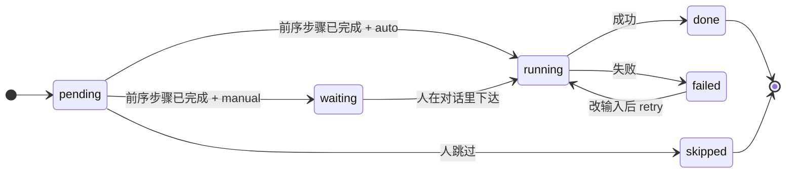
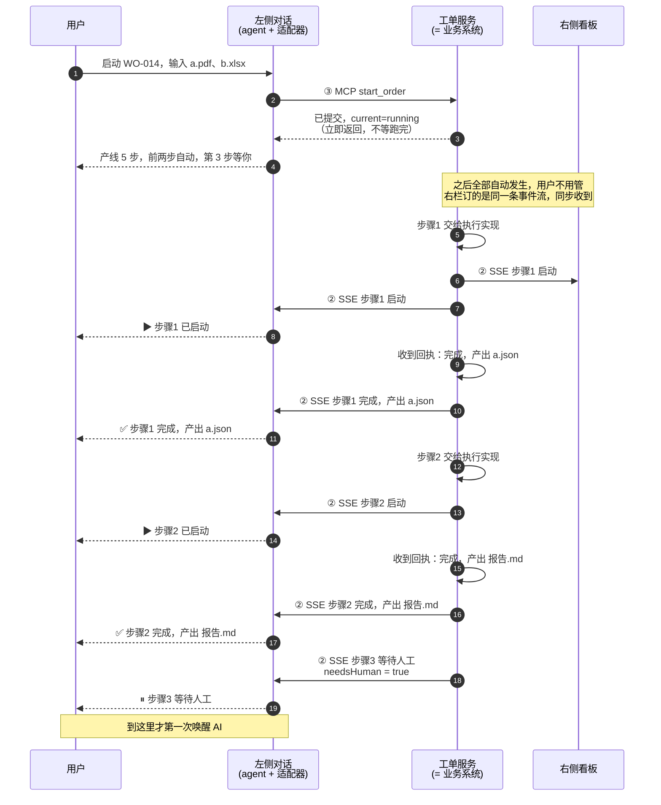
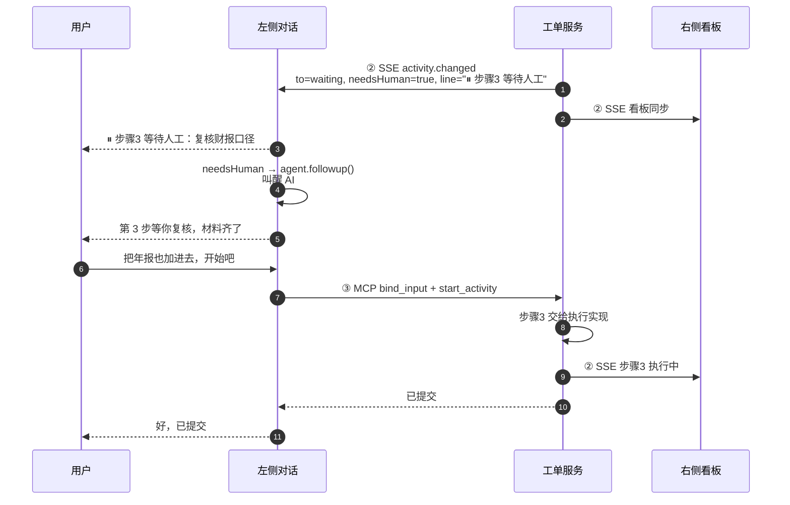
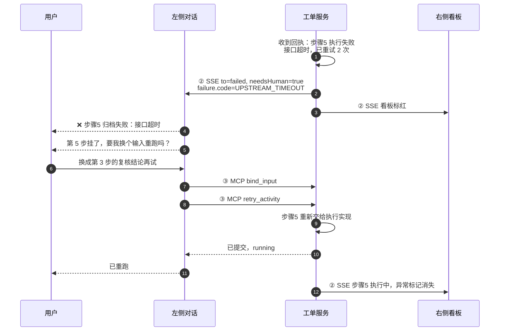

> **已归档：这是讨论存档，不要作为设计依据。当前设计只有一份 → [../DESIGN.md](../DESIGN.md)**

# 设计总览

**这一份是唯一需要通读的文档。** [requirements/0001](requirements/0001-workorder-execution-pane.md)（右侧页面）、[0002](requirements/0002-conversation-pipeline-interaction.md)（左右交互）、[0003](requirements/0003-left-right-system-split.md)（服务边界）是**决策存档**——记录每个选择当时为什么这么定、否掉了什么。想知道「为什么」才去翻它们，平时不用读。

文中的图有两种，按用途选的：

- **整体架构用 ASCII**——架构图要的是**空间布局**（谁挨着谁、谁在上谁在下），而 mermaid 的自动布局恰好把这个信息丢掉，只剩下一堆箭头。
- **时序图与状态机用 mermaid**——它们的布局由语义决定（生命线 + 时间顺序、状态迁移），mermaid 画得比 ASCII 清楚。

两个生成命令：

```sh
node business-agent/tools/build-architecture-ascii.mjs   # 重建第三、六节的 ASCII 图（按显示宽度对齐，自带校验）
node business-agent/tools/render-diagrams.mjs            # 把 mermaid 块渲染成 diagrams/*.png
```

两张 ASCII 图（整体架构、右侧页面）都由脚本按**显示宽度**（中文算两列）逐行对齐，手改必歪，所以要改用脚本重跑。mermaid 的 PNG 必须重新生成的原因是：**DSH 的聊天区与文件预览都不渲染 mermaid**（客户端包里搜不到它，markdown 只走 shiki 语法高亮），存一份 PNG 才能在任何地方看。

| 图 | 在哪 |
|---|---|
| 三、整体架构（ASCII） | 本文件第三节 |
| 六、右侧页面（ASCII） | 本文件第六节 |
| 四、领域模型（状态机，mermaid） | [diagrams/01-四-领域模型.png](diagrams/01-四-领域模型.png) |
| 五、时序一：启动工单，自动跑完 | [diagrams/02](diagrams/02-时序一-启动工单-自动跑完.png) |
| 五、时序二：需要人 → 叫醒 AI | [diagrams/03](diagrams/03-时序二-某一步需要人-把-ai-叫醒.png) |
| 五、时序三：跑挂了 → 对话处置 | [diagrams/04](diagrams/04-时序三-自动活动跑挂了-人在对话里处置.png) |

## 一、这件事是什么

把 DSH Web 界面右侧那块给程序员用的「浏览页」，换成给业务用的**工单流水线看板**。左侧的对话页结构不动。

- **右侧只读**：一个操作按钮都没有。展示产线走到哪、卡在哪、产出了什么。
- **操作全在左侧对话**：需要人时 AI 会主动开口，你回一句它去做。
- **产线自己会跑**：配成自动化的活动由执行引擎推着走，人只在需要自己的时候出现。引擎就在右侧那个工单服务里（第三节），不另起一个进程。

一句话：**右边看，左边说。**

几个词下面反复用，先约定：**工单**是一张要办的单子，**产线**是这张单子的活动序列，**活动**是产线上的一步（也叫「步骤」），**交付件**是活动产出的文件。

## 二、要建的三件东西

| # | 建什么 | 内容 | 状态 |
|---|---|---|---|
| **1** | `workorder-service`（独立包）**＝ 业务系统**，今日是 mock | **执行引擎** · 执行实现（demo 是模拟的）· 产线状态 · 事件流 · 三张脸的接口 · 绑定表 | **已完成**，见 [workorder-service/README.md](workorder-service/README.md) |
| **2** | DSH **适配器**（插件宿主半） | 把服务的事件翻译成对话内容的那层胶水：收 SSE → 写对话进度行 · `needsHuman` → 唤醒 agent · 从 MCP 工具调用里提取绑定 · 把服务接口挂到 `/api/workorder` | 未开始 |
| **3** | **右栏看板**（插件浏览器半） | 产线卡片、交付件、决策记录、驱动提示条 | 布局原型**已画好**（`prototype/workorder-pane.html`），剩下的是改成从服务接口取数 |

第 1 件已完成，自己就能验（**全程不启动 DSH**）：

```sh
cd business-agent/workorder-service
node test/smoke.mjs        # 15 项自检：HTTP / MCP / SSE 三张脸 + 换执行实现
node bin/serve.js          # 独立启动，默认 127.0.0.1:8090；模拟执行每步 4 秒
```

## 三、整体架构

<!-- BEGIN architecture-ascii（由 tools/build-architecture-ascii.mjs 生成，不要手改） -->
```
  ┌─────────────────────────────────────────────────────────┐
  │ 工单服务 workorder-service                              │
  │ = 业务系统；demo 里是 mock 实现，真实部署由业务方提供   │
  │ 独立包与端口 · 零 DSH 依赖                              │
  │                                                         │
  │ 执行引擎：认产线结构 · 推状态机 · 判该不该喊人          │
  │ 执行实现：活动怎么真跑；demo 里是模拟的                 │
  │                                                         │
  │ 产线状态 · 事件流 · 绑定表         MCP 工具面           │
  └───────┬─────────────────────┬───────────────┬───────────┘
          │                     │               │
            ① HTTP 查询 · 绑定    ② SSE 事件流    ③ MCP 查询 / 推进
          │                     │               │
          ▼                     ▼               │
   ┌────────────────┐   ┌────────────────────┐  │
   │ 右侧：工单看板 │   │ DSH 适配器         │  │
   │ 只读，订事件流 │   │ 绑死 DSH 的那一层  │  │
   └────────────────┘   └────────┬───────────┘  │
                                 │ 进度行·唤醒  │
                                 ▼              │
                     ┌─────────────────────┐    │
                     │ 左侧：对话          │    │
                     │ 用户 ⇄ agent        │────┘
                     └─────────────────────┘
```
<!-- END architecture-ascii -->

**工单服务就是业务系统。** 今天这一块是 mock 实现；真实部署时由业务方提供同一套东西，**对外的三张脸不变**——所以我们在这边把接口定下来，那就是将来要交出去的契约。它内部有三样，都是它自己的实现，不是并列的「部分」：

- **执行引擎**：认产线结构、判输入是否就绪、推状态机、决定什么时候该喊人。**这一层不换。**
- **执行实现**：活动真的怎么跑。demo 里是模拟的（等几秒算完成，可以注入一次失败）；真实实现里换成真的调用。
- **状态与三张对外面**：产线状态、事件流、绑定表 + 读接口 / 事件流 / 工具面。

代码上「执行实现」就是一个对象：`createService({ executor })` 缺省接内置的模拟实现，想让活动真的跑就换掉这一个对象，引擎与三张脸一个字节都不用改。`node test/smoke.mjs` 里有一条就是拿一个自定义实现跑一遍，证明换掉它不影响引擎的行为。

这条「交出去 / 收回执」的一来一回说的是：**服务把要执行的活动交出去**（第 1 步该跑了），**执行实现把结果回执回来**（跑完了，产出 a.json / 失败了，接口超时）。引擎只认回执，不自己判完成、也不自己编失败原因。

**四个部分里只有一个不依赖 DSH。** 工单服务可以单独启动、单独 `curl`，将来整个搬走；另外三个——适配器（宿主半插件）、右栏看板（浏览器半插件）、左侧对话（现有）——都长在 DSH 上，只是「换掉它的理由」各不相同：换 agent 只动适配器与对话，换宿主界面只动看板。三条规则把这条边界守住：

1. **工单服务不 import 任何 DSH 的东西**——不用 `ctx`、不用会话类型。服务里一旦出现 `agent.session`，它就不再是独立系统了。
2. **右栏只用服务的接口拿数据**，不读 DSH 的会话状态——否则永远搬不出 DSH。
3. **绑定表存服务、绑定「怎么建立」归适配器**。前者是「哪个客户端在看哪张工单」，后者在 DSH 上是从 MCP 工具调用里读；换 agent 后建立方式会变，存储方式不会。

检验分治有没有真成立：**把 DSH 整个拿掉，服务还能不能独立跑、右栏要的数据还能不能拿到？** 右栏自己当然是 DSH 的一部分，所以这里检验的是它的**数据来源**不依赖 DSH——今天 `curl` 服务的接口就能拿到同样的数据。`node test/smoke.mjs` 就是这条检验的执行版。

**一个容易被忽略的方向**：服务**永远不知道 agent 的存在**。它只说「WO-014 第 3 步从 running 变成 waiting」；至于这句话在 DSH 里变成一行提示、在别的 agent 里变成什么，是**适配器**的事。所以将来换 agent，只有适配器要重写——工具面已经天然可移植（MCP 是跨 agent 标准）。

## 四、领域模型

```
WorkOrder 工单
  id, title, status(running|blocked|done), owner
  materials[]                 工单级材料，不来自任何活动
  activities[]                有序的产线
  currentActivitySeq          当前进行到第几步

Activity 活动
  seq, title, assignee
  type: tool | agent | manual | inspection      这一步在做什么
  automation: auto | manual                    这一步由谁触发（与 type 正交）
  status: pending | waiting | running | done | failed | skipped
  inputs[]  = InputBinding                     来自前序步骤输出的绑定，可改
  outputs[] = ArtifactRef
  attempts, startedAt, finishedAt, failure{code,message}

InputBinding 输入绑定
  name, kind
  fromActivitySeq?            取自哪一步的输出；缺省表示来自工单材料

Decision 决策记录
  at, actor(pipeline|agent), activitySeq, action, reason
                              谁改的：产线自己 / 对话里的 agent
```

**别把两个「上游」搞混**：领域模型里的「上游」是**产线里的前序步骤**（第 3 步的输入来自第 2 步的输出）；代码里那个 `state.executor` 是**执行实现**（活动真的怎么跑），跟产线顺序无关。

**两个维度必须分清楚**：`type` 说的是这一步在做什么，`automation` 说的是它由谁触发。四个类型都能出现在两种自动化标记下——「工具 + 需人工」是人工触发一次接口调用。**不能靠类型推断自动化**，界面上要单独标出来。

**`waiting` 是这套模型的关键状态**：轮到它了，但它是人工活动，产线推不动。它与 `pending`（还没轮到）必须分开，因为只有它需要人。



图上只画常规路径。**`failed` 与 `skipped` 实际可以落在任何一步上**——它们是人在对话里的判定（质检驳回、跳过某步），不限于「轮到了才判」。

## 五、三个关键过程

### 时序一：启动工单，自动跑完



**这张图最该记住的一点**：中间那一大段，**AI 一次都没有被唤醒**——进度只是一行行写进对话，不产生模型回复、不额外跑一轮。这就是「展示」和「唤醒」必须分开的意义。（代价是这些进度行会进模型历史，所以只发状态迁移、一行一个——见第七节第 2 条。）

**第二点**：中间那几步的推进**不是服务自己算出来的**——引擎把活动交给「执行实现」（`submit`），等它的回执（`poll`），再把回执变成一条事件。demo 里执行实现是模拟的（等几秒就算跑完）；真实实现里它去真的调工具、真的跑活动，引擎这一侧一行不改。所以那张图上的 `S->>S` 是**服务内部的两样东西在说话**（引擎 ↔ 执行实现），不是自己跟自己确认了一遍。

### 时序二：某一步需要人 → 把 AI 叫醒



### 时序三：自动活动跑挂了 → 人在对话里处置



## 六、右侧页面

布局原型已经画好并确认过：`business-agent/prototype/workorder-pane.html`（单文件，双击就能开）。页面长这样：

<!-- BEGIN pane-ascii（由 tools/build-architecture-ascii.mjs 生成，不要手改） -->
```
┌────────────────────────────────────────────────────────────┐
│ 作业区（约 3/4）                                           │
│  [ 作业记录 ]  [ 决策记录 ]        ← 两个 tab              │
│                                                            │
│  ①  [工具]   拉取客户主数据      自动      已完成          │
│   输入 工单信息 → 输出 customer.json                       │
│  ②  [agent]  生成授信分析报告    自动      执行中          │
│   输入 ←① customer.json                                    │
│  ③  [手工]   复核财报口径        需人工    等待人工        │
│   输入 ←② 授信分析报告.md                                  │
│                                                            │
│ 第 3 步需人工 · 对 agent 说「开始第 3 步」                 │
├────────────────────────────────────────────────────────────┤
│ 交付件区（约 1/4）  来自活动 ①②③ …                         │
└────────────────────────────────────────────────────────────┘
```
<!-- END pane-ascii -->

- **活动卡片**自上而下四段：类型徽章 + 标题 + 状态 / **自动化标记**与执行者 / 输入件与输出件 / 异常原因。输入胶囊带 `←n` 标明取自哪一步的输出——绑定可改，所以来源必须看得见。
- **状态色**：`待开始` 灰、`等待人工` 琥珀、`执行中` 蓝、`已完成` 绿、`异常` 红。
- **驱动提示条**常驻在作业区底部，随当前一步变四种形态：**自动执行中**「无需操作」／**等待人工**「第 3 步需人工 · 对 agent 说『开始第 3 步』」（质检步改说「给出第 5 步的质检结论」）／**这一步失败**「在左侧对话里改完输入后说『重跑第 5 步』」／**其余情况**「产线推进中 · 当前第 N 步」。一句话：**提示条只负责告诉人「现在该不该我出手、要说话的话说什么」**。
- **卡片上没有按钮**。整张页面唯一的交互是打开交付件（点文件行走底座的文档查看器）。
- **数据怎么来的**：页面自己不连工单服务的端口，它调宿主代理出来的 `/api/workorder/*`（适配器把服务接口挂在那儿，顺带落在底座已有的信任围栏内）。同一份数据两边看：右栏拉 `GET /orders/:id` 拿全量，再订事件流做增量。
- 展开右栏就是这一页：靠覆盖层把底座的「工作区文件」与「新终端」两个页面类型停掉，右栏只剩工单页这一个入口，于是它就成了默认页。

## 七、界面上的七条硬规矩

1. **右侧只读**——不做第二个写入口。两套入口会让权限、审计归属、谁改的状态都说不清。
2. **进度写进对话，但不唤醒 AI**——往对话里追加一条**插件来源的提示行**：界面上显示为一行上下文提示，不占用户气泡、也不产生模型回复。代价是它**会进模型历史**，之后每一轮请求都要读一遍，所以只发状态迁移（开始、完成、失败、等待人工）、文案只留一行；好处是 agent 最后被叫醒时，前面发生了什么已经在它眼前，不用再查一遍。
3. **只有 `needsHuman` 才唤醒 AI**——每一步的启动、完成、跳过都会在对话里留一行记录，但只有 `waiting`（等人工）和 `failed`（挂了）会真去叫醒 agent。一条 20 步的产线因此最多喊人一两次，而不是 20 次。
4. **唤醒有刹车**——空闲才 `followup` 开新轮，忙时只 `inject` 搭车；连续唤醒有预算，且**只由真人输入重置**。防的是「唤醒 → agent 动手 → 产线又变 → 再唤醒」的自激循环。
5. **投递 ≠ 处理**——`followup()` 返回即入队，不承诺模型会处理、更不承诺工单被推进。插件绝不把「投递成功」写成一次操作。
6. **工具一律立即返回**——「启动工单」返回「已提交」，不等到跑完。跑两小时的活动不能占住一个 turn。
7. **外部文本一律不可信**——活动标题、失败原因来自业务数据，甚至可能来自另一个模型，进对话时要标注为不可信内容，不能拼成指令。

## 八、服务的三张脸

| 脸 | 路径 | 消费者 | 说明 |
|---|---|---|---|
| ① 读接口 | `GET /orders` · `/orders/:id` · `/orders/:id/decisions` · `PUT /bindings/:clientId` | 右侧看板（读）· 适配器（写绑定） | HTTP。只读查询；唯一的写操作是登记「谁在看哪张单」，不碰工单数据 |
| ② 事件流 | `GET /events[?orderId=]` | 右栏**和**适配器 | SSE。两边订的是**同一条**流 |
| ③ 工具面 | `POST /mcp` | agent | MCP（streamable-http）。工具名在宿主侧变成 `mcp__workorder__*` |

三条容易看漏的说明：

- **路径不带 `/api` 前缀**，那是宿主的信任围栏约定、属于适配器的事。适配器把服务接口挂到 `/api/workorder/*` 下，浏览器的右栏页面调的是后者。
- **工单内容只有产线自己会改**。绑定的那个 `PUT` 写的是「哪个客户端在看哪张工单」，不是工单数据——所以「页面只读」与「有一个 PUT」并不矛盾。
- **工单从哪来**：demo 里是服务内置的两张示例单（`src/seed.js`）；真实部署由业务系统推来。第一版不做工单增删。

事件载荷是**主机中立**的：只说产线发生了什么，不出现会话、消息、卡片这类词。其中两个字段是刻意的设计：

- **`needsHuman` 由服务判定**，不由消费者各算一遍——服务知道活动是不是人工的、是不是失败了。让每个适配器重复实现必然漂移。
- **`line` 是一行给人看的文案**（如 `⏸ 步骤 3「复核财报口径」等待人工处理`）。有了它，适配器不必再拼一遍；没有它，各适配器就会各写各的。

**三条必须跟业务系统对齐的约定**：工单号字段叫 `orderId`（适配器要从工具调用参数里读它建立绑定）；所有工具立即返回；MCP server 不返回 `instructions`（否则会被自动注入系统提示词，而产线状态会变，污染 KV 缓存）。

> MCP 是什么：一套「把工具暴露给 AI」的通用协议。好处是这张工具面不绑 DSH——任何认 MCP 的 agent 都能直接调它，将来换左侧 agent，服务与工具面一行都不用改。

## 九、明确不做的

- 不改左侧对话页的结构（消息流、输入框、审批条、文件链接形态照旧）
- 不改 agent loop，不新增会话事件类型
- 不做产线编排：一张工单有几步、每步是什么类型、哪一步自动化、输入接哪一步的输出，全部由业务系统给出。插件不提供编排界面；服务也不提供编排逻辑，它只按这些设定判断「这一步能不能开始」。
- 不把产线状态做成常驻的系统提示词段落
- 第一版不做认证与鉴权、不做工单增删

## 十、进度与下一步

**已完成**：`workorder-service` 三张脸跑通，15 项自检全绿，不需要 DSH 就能独立启动与验证。执行引擎会自己推进自动活动、在人工活动处停住、能演示失败与人工处置；执行实现是显式可换的一个字段。

**下一步按这个顺序**：

1. **DSH 适配器**：订 SSE → 把 `line` 写成对话里的进度行 → `needsHuman` 时唤醒 → 从 MCP 工具调用里提取绑定 → 把服务接口挂到 `/api/workorder`
2. **右栏看板**：把原型接上服务的接口

**对接时要交给业务方的（契约在我们这边，不是等他们给）**：

- **三张脸的接口清单与事件载荷字段**（第八节）——真实业务系统照这套长，右侧的看板与适配器才一行不用改。
- **两条硬约定**：工单号字段叫 `orderId`；工具一律立即返回。
- **执行实现的形状**（`submit` / `poll`，见 [workorder-service/README.md](workorder-service/README.md)）——若只替换「活动怎么真跑」这一步而保留这套服务骨架，就按这个对齐。

## 十一、想深挖时看哪份

| 想知道 | 看 |
|---|---|
| 右侧页面为什么这么设计、默认页怎么抢过来、挂载方式 | [0001](requirements/0001-workorder-execution-pane.md) |
| 唤醒为什么用 `followup`、进度为什么不能走自定义会话事件、绑定怎么读 | [0002](requirements/0002-conversation-pipeline-interaction.md) |
| 为什么拆成两个系统、服务为什么长三张脸、事件面为什么用 SSE | [0003](requirements/0003-left-right-system-split.md) |
| 服务怎么跑、每个接口与工具的确切形状 | [workorder-service/README.md](workorder-service/README.md) |
| 特性登记与验证命令 | [FEATURES.md](FEATURES.md) |
